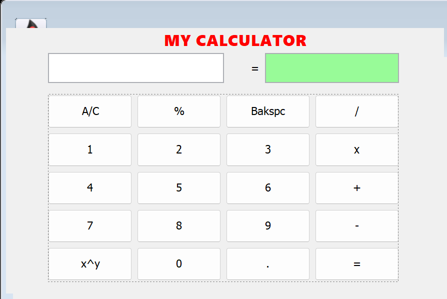

# 🧮 Java Swing Calculator

A simple Calculator application built using **Java Swing** that performs basic arithmetic operations through a graphical user interface.

## 📌 Features

- ➕ Addition
- ➖ Subtraction
- ✖ Multiplication
- ➗ Division
- 📊 Percentage Calculation
- 🔢 Power Calculation (x^y)
- ⌫ Backspace
- 🧹 Clear All (A/C)
- 🖥️ Simple and user-friendly GUI

## 🛠️ Technologies Used

- Java
- Java Swing
- Eclipse IDE

## 📂 Project Structure

```
Calculator/
│── src/
│   └── personalCalc/
│       └── Calc.java
│── README.md
```

## 🚀 How to Run

1. Clone the repository

```bash
git clone https://github.com/DevanshuG05/Calculator.git
```

2. Open the project in Eclipse or any Java IDE.

3. Navigate to:

```
src/personalCalc/Calc.java
```

4. Run the `Calc.java` file.

<h2>📷 Preview</h2>


Example:

```
calculator.png
```

```markdown

```

## ⚙️ Supported Operations

| Operation | Example |
|-----------|---------|
| Addition | 10 + 5 |
| Subtraction | 20 - 8 |
| Multiplication | 12 × 3 |
| Division | 25 / 5 |
| Percentage | 20%500 = 100 |
| Power | 2^5 = 32 |

## 📖 Future Improvements

- Scientific calculator functions
- Keyboard input support
- Multiple operations in a single expression
- Calculation history
- Dark mode
- Better error handling
- Responsive UI

## 🤝 Contributing

Contributions are welcome!

1. Fork the repository
2. Create a feature branch
3. Commit your changes
4. Push the branch
5. Open a Pull Request

## 👨‍💻 Author

**Devanshu Gaidhane**

GitHub: https://github.com/DevanshuG05

---

⭐ If you like this project, don't forget to star the repository!
